# PVT v2: PotatoDR Dataset

By Braulio Nayap Maldonado Casilla and Paul Antony Parizaca Mozo

## Usage

1. **Clone the repository locally:**

   ```bash
   git clone https://github.com/ShinjiMC/PVT_PlantVillage.git
   ```

2. **Create and activate the Conda environment:**

   ```bash
   conda activate pvt
   ```

3. **Install the required dependencies:**

   ```bash
   pip install timm==0.3.2
   pip install torch torchvision torchaudio --extra-index-url https://download.pytorch.org/whl/cu126
   pip install mmcv==1.3.8
   ```

4. **Verify that everything is working correctly:**

   Run the following command to check if `torch` is correctly installed and if the GPU is available (if applicable):

   ```bash
   python3 -c "import torch; print(torch.__version__); print(torch.cuda.is_available())"
   ```

   You should see an output like this:

   ```
   2.4.1+cu121
   True
   ```

## Data preparation

Here’s the modified text:

## Data preparation

Download and extract the PotatoDR Dataset from the following link:  
[PotatoDR Dataset v1.0](https://github.com/ShinjiMC/PotatoDR_Dataset/archive/refs/tags/1.0v.zip)

The dataset is already structured and does not require additional reorganization. The directory structure is as follows:

```
/PotatoDR_Dataset/Potato_Status/
  train/
    Potato___Early_blight/
      img1.jpeg
    Potato___healthy/
      img2.jpeg
    Potato___Late_blight/
      img3.jpeg
  val/
    Potato___Early_blight/
      img4.jpeg
    Potato___healthy/
      img5.jpeg
    Potato___Late_blight/
      img6.jpeg
```

This dataset is ready to be used directly for training and validation.

## Model Zoo

- PVTv2 on PotatoDR Dataset

| Method           | Size | Acc@1 | #Params (M) | GFLOPs | Config                                   | Download                                                                                               |
| ---------------- | :--: | :---: | :---------: | :----: | ---------------------------------------- | ------------------------------------------------------------------------------------------------------ |
| PVT-V2-B0        | 224  | 96.78 |    3.41     |  0.57  | [config](configs/pvt_v2/pvt_v2_b0.py)    | 37Mb [[GitHub]](https://github.com/ShinjiMC/PVT_PlantVillage/releases/download/PVT2v1.0/pvt_v2_b0.zip) |
| PVT-V2-B1        | 224  | 97.33 |    13.5     |  2.12  | [config](configs/pvt_v2/pvt_v2_b1.py)    | 143Mb [[GitHub]](https://github.com/whai362/PVT/releases/download/v2/pvt_v2_b1.pth)                    |
| PVT-V2-B2-Linear | 224  | 97.78 |    22.04    |  3.92  | [config](configs/pvt_v2/pvt_v2_b2_li.py) | 233Mb [[GitHub]](https://github.com/whai362/PVT/releases/download/v2/pvt_v2_b2_li.pth)                 |
| PVT-V2-B2        | 224  | 98.44 |    24.85    |  4.04  | [config](configs/pvt_v2/pvt_v2_b2.py)    | 262Mb [[GitHub]](https://github.com/whai362/PVT/releases/download/v2/pvt_v2_b2.pth)                    |
| PVT-V2-B3        | 224  | 98.11 |    44.73    |  6.92  | [config](configs/pvt_v2/pvt_v2_b3.py)    | 472Mb [[GitHub]](https://github.com/whai362/PVT/releases/download/v2/pvt_v2_b3.pth)                    |
| PVT-V2-B4        | 224  | 98.44 |    62.04    | 10.14  | [config](configs/pvt_v2/pvt_v2_b4.py)    | 655Mb [[GitHub]](https://github.com/whai362/PVT/releases/download/v2/pvt_v2_b4.pth)                    |
| PVT-V2-B5        | 224  | 98.11 |    81.44    | 11.75  | [config](configs/pvt_v2/pvt_v2_b5.py)    | 859Mb [[GitHub]](https://github.com/whai362/PVT/releases/download/v2/pvt_v2_b5.pth)                    |

---

## Evaluation

To evaluate a pre-trained PVT-Small model on the PotatoDR_Dataset validation set using a single GPU, run the following command:

```bash
sh dist_train.sh configs/pvt_v2/pvt_v2_b2_li.py 1 --data-path ./PotatoDR_Dataset/val --resume ./checkpoints/pvt_v2_b2_li/checkpoint.pth --eval
```

This will output the evaluation results, including accuracy and loss metrics. For example:

```
* Acc@1 97.788 Acc@5 100.000 loss 0.210
```

- **Acc@1**: The top-1 accuracy of the model on the validation dataset.
- **Acc@5**: The top-5 accuracy, indicating the percentage of times the correct class is within the top-5 predictions.
- **Loss**: The model's loss value after evaluation.

---

## Training

To train the PVT-Small model on the PotatoDR_Dataset with a single GPU for 100 epochs, run the following command:

```bash
sh dist_train.sh configs/pvt_v2/pvt_v2_b2_li.py 1 --data-path ./PotatoDR_Dataset
```

This will initiate the training process, using the dataset from the `train/` folder of the `PotatoDR_Dataset`. During training, the model will update its weights for 100 epochs, based on the training data.

---

## Calculating FLOPS & Params

To calculate the FLOPS (Floating Point Operations Per Second) and the number of parameters for the PVT-Small model, run:

```bash
python get_flops.py pvt_v2_b2_li
```

The output will provide the input shape, FLOPS, and the number of parameters as follows:

```
Input shape: (3, 224, 224)
Flops: 4.04 GFLOPs
Params: 25.36 M
```

- **Input shape**: The shape of the input image fed into the model (channels, height, width).
- **Flops**: The number of GFLOPs (billion floating point operations) required for one forward pass.
- **Params**: The total number of parameters (weights) in the model.

This information helps evaluate the computational cost and complexity of the model.

---

## Test a Model with Your Own Image

To test the model with your own image, make sure the following directory structure is in place:

```
checkpoints/
  pvt_v2_b2_li/
    checkpoint.pth
    log.txt
```

- The `checkpoint.pth` file is the trained model’s weights.
- The `log.txt` file contains training logs.

Once your model and checkpoints are properly placed, you can run the following command to test the model on your own image:

```bash
python visionTest.py --model_name pvt_v2_b2_li --checkpoint_dir checkpoints/
```

- **`--model_name`**: Specify the name of the model you trained (e.g., `pvt_v2_b2_li`).
- **`--checkpoint_dir`**: Provide the path to the directory containing the checkpoint files (e.g., `checkpoints/`).

This command will load the model and use the provided checkpoint to evaluate it on your input image.

## Results

The results from training the models were as follows:

- **pvt_v2_b0**:

  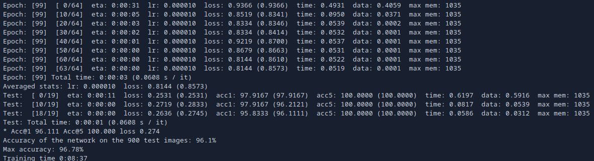

  And when tested with an image using the visionTest, the result was:

  

- **pvt_v2_b1**:

  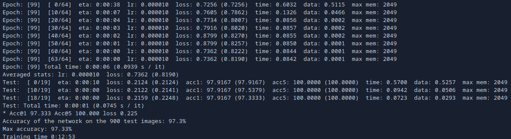

  And when tested with an image using the visionTest, the result was:

  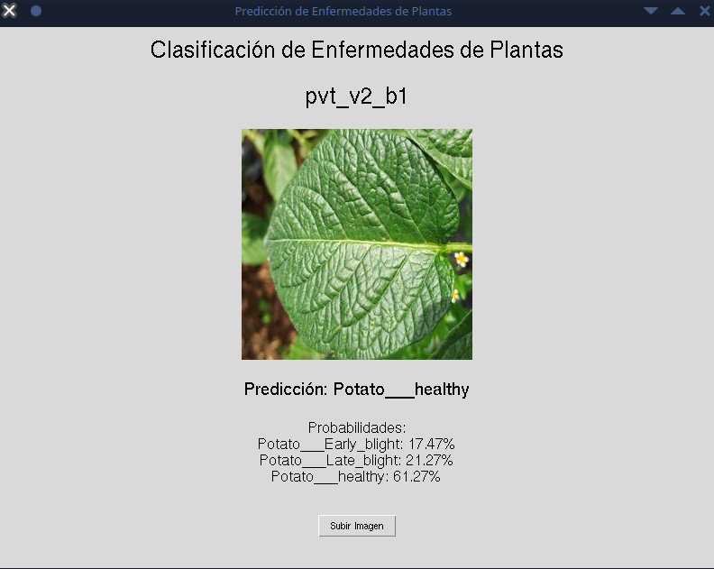

- **pvt_v2_b2**:

  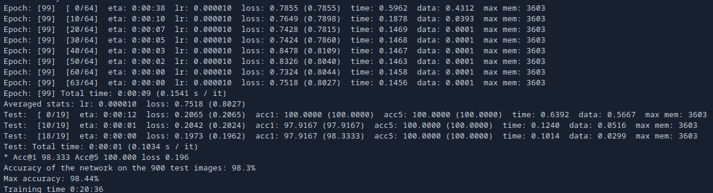

  And when tested with an image using the visionTest, the result was:

  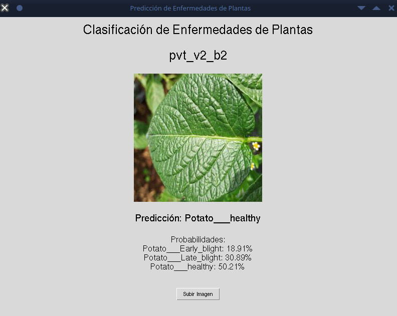

- **pvt_v2_b2_li**:

  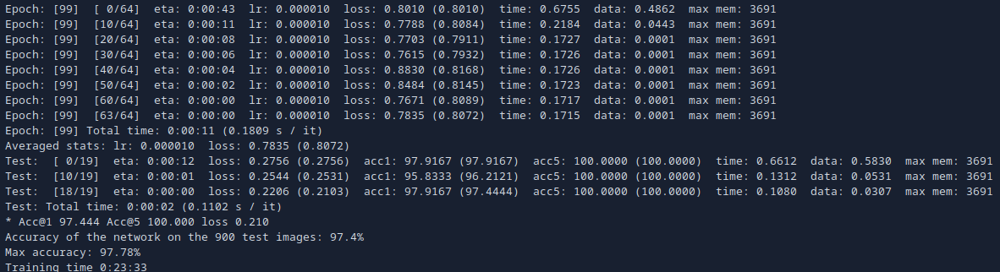

  And when tested with an image using the visionTest, the result was:

  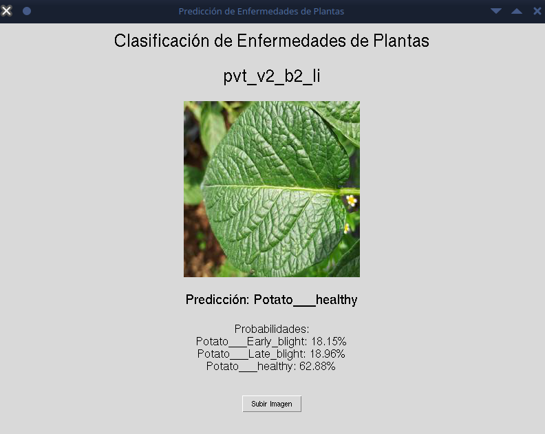

- **pvt_v2_b3**:

  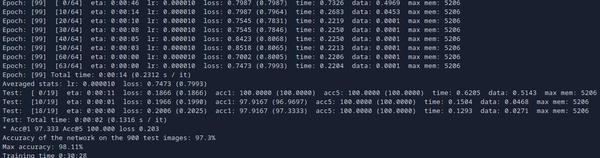

  And when tested with an image using the visionTest, the result was:

  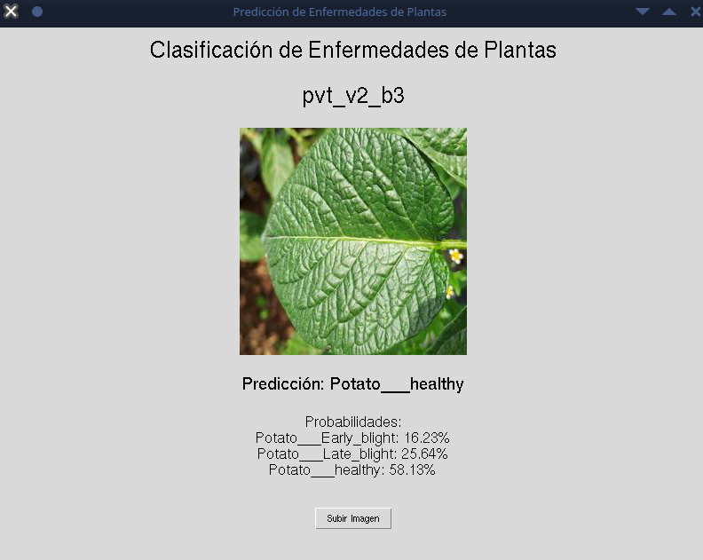

- **pvt_v2_b4**:

  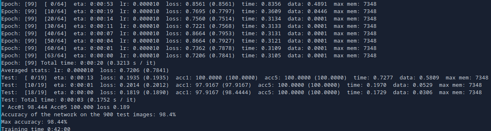

  And when tested with an image using the visionTest, the result was:

  

- **pvt_v2_b5**:

  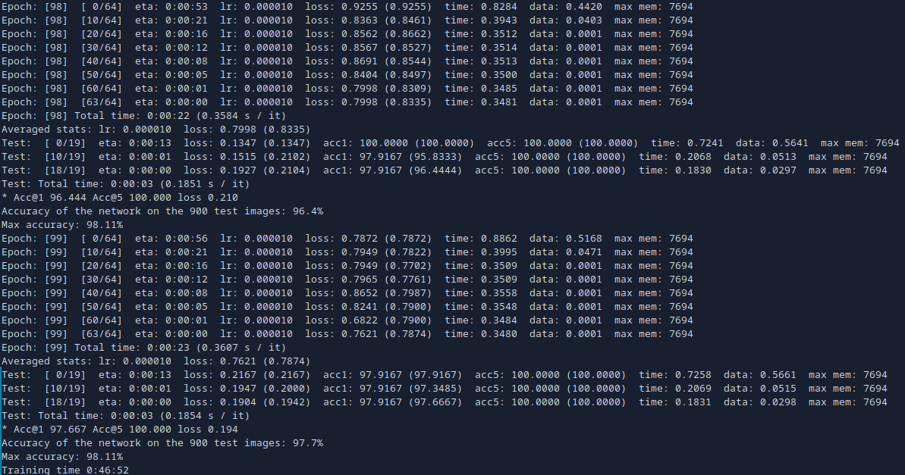

  And when tested with an image using the visionTest, the result was:

  

## License

This repository is released under the Apache 2.0 license as found in the [LICENSE](LICENSE) file.
